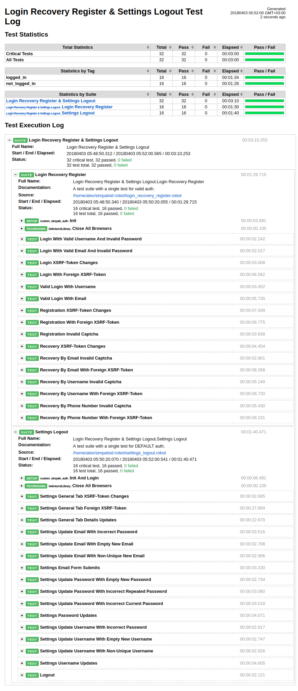

Robot Framework tests for SimpalsID
===================================

This folder contains all tests I created for SimpalsID using Selenium, Selenium2Library, Python and Robot Framework v3.
To run tests Selenium2Library must be imported into your Robot test suite. 

.. contents::
   :local:

Directory contents
------------------

resources.robot
    Resources needed by all those tests.

login_recovery_register.robot
    Contains actual test cases for login, recovery and registration.

settings_logout.robot
    Contains actual test cases for settings and logout.

custom_simpals_auth.py
    Python library used by all those tests.

Requirements
------------

- Python 2.7.*
- Robot Framework 3.0.*
- Selenium 3.9.0
- Selenium2Library 3.0.*
- Google Chrome Driver 2.*

Installation
------------

If you already have Python 2.7 with `pip <http://pip-installer.org>`_ installed,
you can simply run::

    pip install robotframework selenium robotframework-selenium2library

After it, `download <https://sites.google.com/a/chromium.org/chromedriver/downloads>`_ chrome driver and add the path to your webdriver in the PATH system variable::

	export PATH=$PATH:/path/to/driver/chrome-driver

Usage & Last Result
-------------------

Run::

	robot login_recovery_register.robot settings_logout.robot

